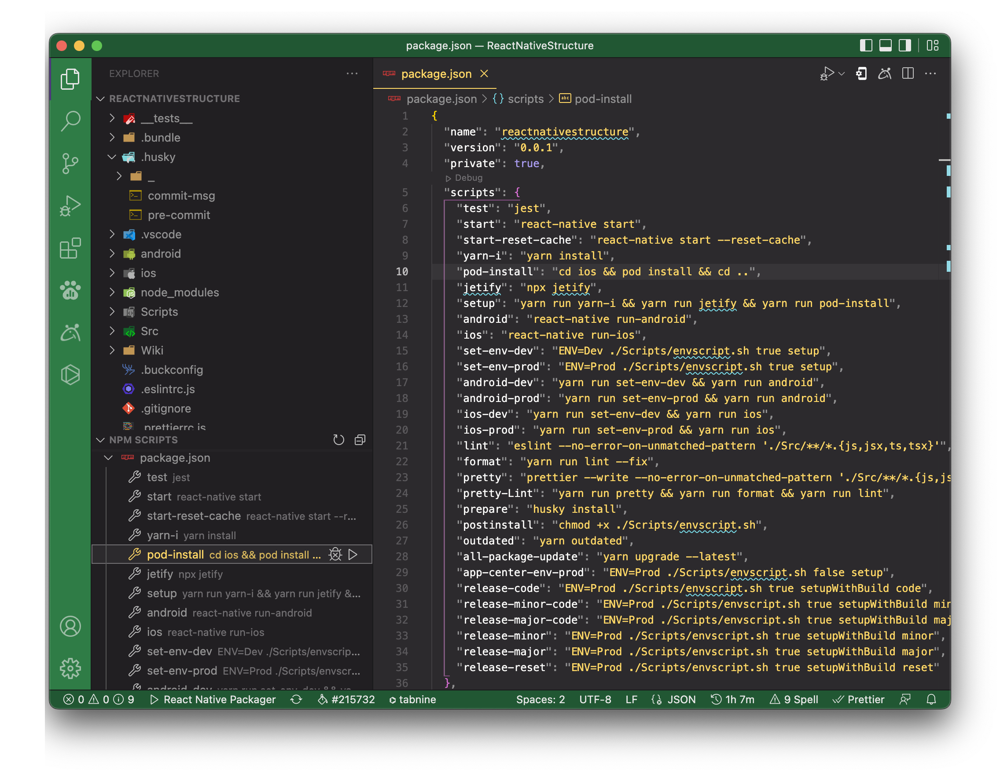
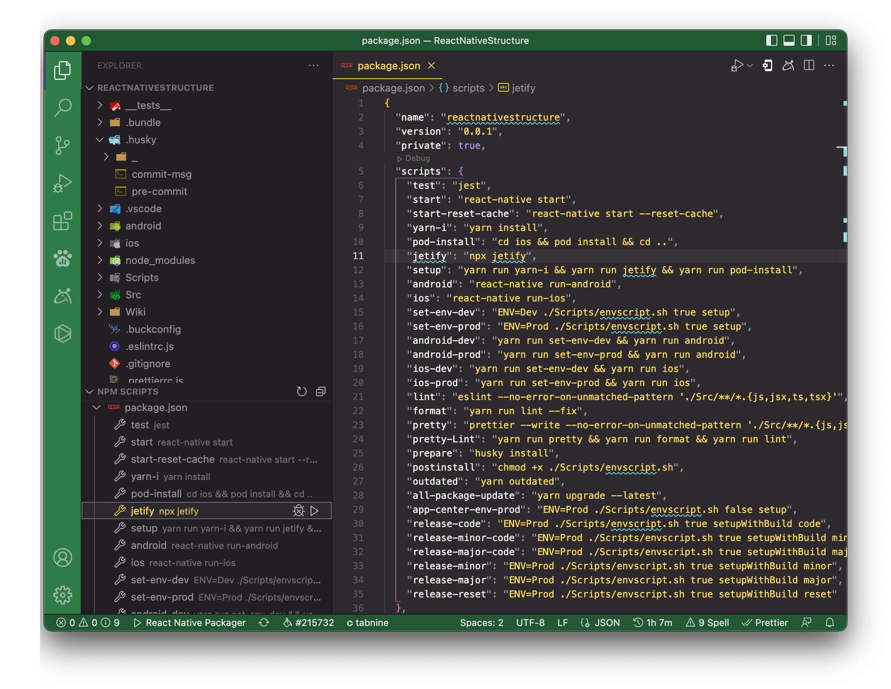

Before jumping into the project setup makes sure you have completed React Native setup on your Personal computer or laptop. For More details, you can visit: [React Native CLI](https://facebook.github.io/react-native/docs/getting-started)

1. Git clone this repo: `git clone -b <branch> <remote_repo>`
1. Change directory to the cloned repo: `cd <dir>`
1. Install needed dependencies package using `yarn` **OR** `yarn install`
1. Based on the platform
   1. For iPhone/IOS,
       Before Install pods, Make sure install CocoaPods using `sudo gem install cocoapods`
       Change directory to ios `cd ios` and install pods with `pod install`
   1. For Android,
       Run Jetify for Third-Party library converts in AndroidX using `npx jetify` (This needs to be done only for the first time after checking out the repo or any new package install.)
       Make sure you are in the project root directory.

## Other way

1. Git clone this repo: `git clone -b <branch> <remote_repo>`
1. Open project in vs-code.
   1. Open NPM SCRIPT section in EXPLORER section.
   1. Trigger play button of `yarn-i`
       
1. Based on the platform
   1. For iPhone/IOS,
       Before Install pods, Make sure install CocoaPods using `sudo gem install cocoapods`
       Trigger play button of `pod-install`
       
   1. For Android,
       Run Jetify for Third-Party library converts in AndroidX. Trigger play button of `jetify` (This needs to be done only for the first time after checking out the repo or any new package install.)
       Make sure you are in the project root directory.
       
