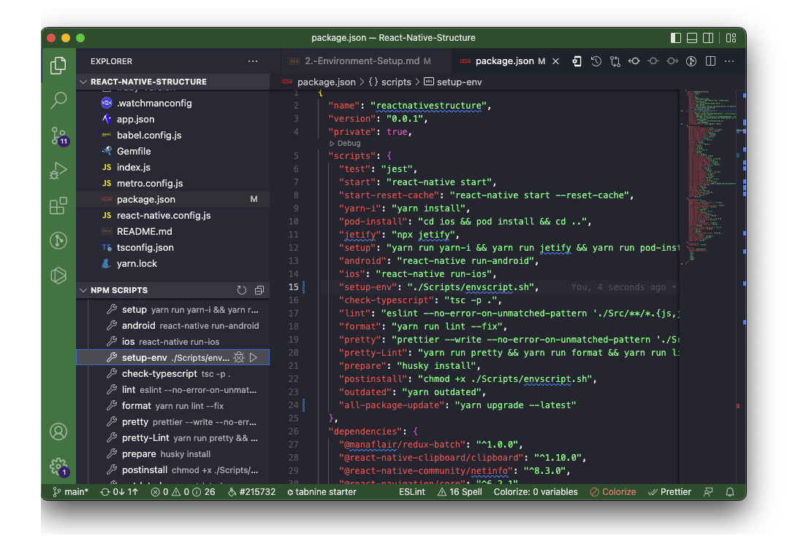
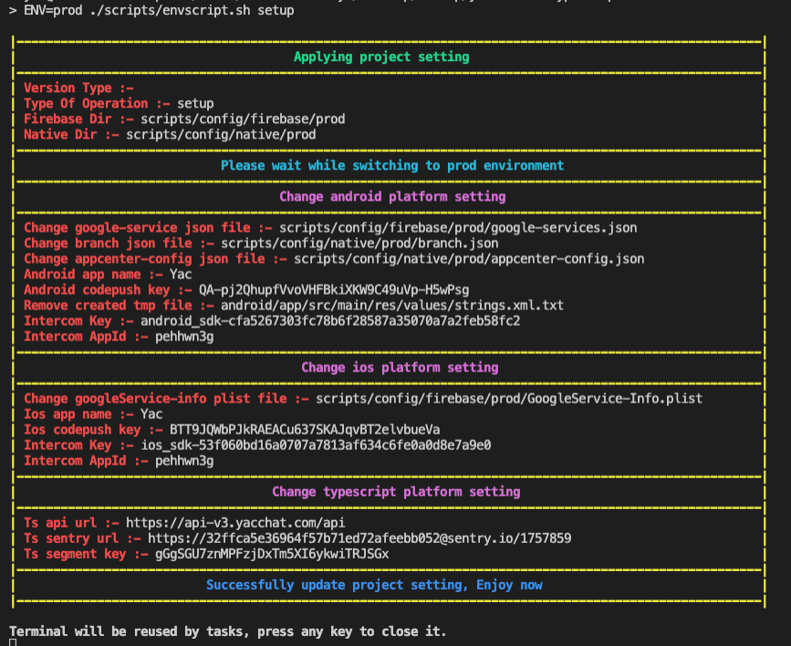

In the current project structure we have to set up Two different types of environment, First one is **Production** and Second one is **Development**.

Open project in the Visual studio code tool.

### 1. Setup Environment with **Debug** & **Release** mode.

1. Open terminal `ctrl + ~`
2. Run It
   ```bash
   ./Scripts/envscript.sh
   ```

## Other Way

### 1. Setup Environment with **Debug** & **Release** mode.

1. Open NPM SCRIPT section in EXPLORER section.
1. Trigger play button of `setup-env`
   <br />

# Explain envscript.sh file in brief

This shell script we will ask few question when excute a script. like below listed

#### **_Do you want to used custom colors for output? say yes/y or no/n :_** yes, no, y, n

#### **_Used Python3 for destructure json value? say yes/y or no/n :_** yes, no, y, n

#### **_Which environment you have setup? :_** Dev, Prod, Qa, Staging

#### **_Which type of operation perform? :_** setup, build, keystore, setupWithBuild, setupWithKeystore, buildWithKeystore

#### **_Which version type to increase from build? :_** major, minor, code, majorWithCode, minorWithCode, reset, cancel.<br />

1. Used Color
   <br />Defined to identify custom colors used or not.
1. Type of operation.
   <br />Defined to identify which type of operation perform. means
   <br />Let's you have pass `setup` then script only do to all React native and native configuration but not increase build version & generate keystore.
   <br />Let's you have pass `build` then script only do to increase build version but not React native and native configuration & generate keystore.
   <br />Let's you have pass `keystore` then script only do to generate keystore file but not React native and native configuration & increase build version.
   <br />Let's you have pass `setupWithBuild` then script do to all React native and native configuration with increase React native and native build version based on pass value of `versionType`.
   <br />Let's you have pass `setupWithKeystore` then script do to all React native and native configuration with generate keystore file.
   <br />Let's you have pass `buildWithKeystore` then script do to increase React native and native build version based on pass value of `versionType` with generate keystore file.
1. Version Type.
   <br />Let's explain what is major, minor and code.
   <br />Let's assume our app version definition is **v5.0(4)** then here '5' is major, '0' is minor and '(4)' is build code.

   <br />Defined to identify which type of version number upgrade. means
   <br />Let's you have pass `major` then script will increase major version, minor version set zero(0) and build code as it is.
   <br />Let's you have pass `minor` then script will major version as it is, increase minor version and build code as it is.
   <br />Let's you have pass `code` then script will major version as it is, minor version as it is and increase build code.
   <br />Let's you have pass `majorWithCode` then script will increase major version, minor version set zero(0) and increase build code.
   <br />Let's you have pass `minorWithCode` then script will major version as it is, increase minor version and increase build code.
   <br />Let's you have pass `reset` then script will reset with initial version value.
   <br />Let's you have pass `cancel` then script will major version as it is, minor version as it is and build code as it is. means nothing to change in build version.

This Script will change below list of configuration.

1. Replace Firebase google service file - In Both Platform(android/ios)
1. Replace Appcenter config file - In Android Platform
1. Change App Name. - In Both Platform(android/ios)
1. Change Codepush Key. - In Both Platform(android/ios)
1. Change API URL - In React Native Platform
1. Change Sentry URL - In React Native Platform
1. Upgrade version - In All Platform(android/ios/react native)

Script output look like below
<br />
