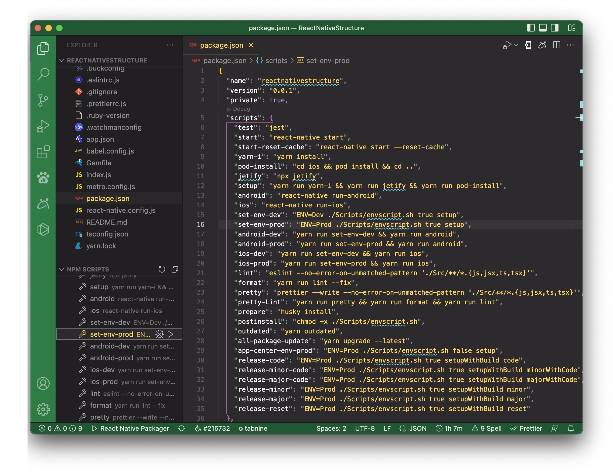
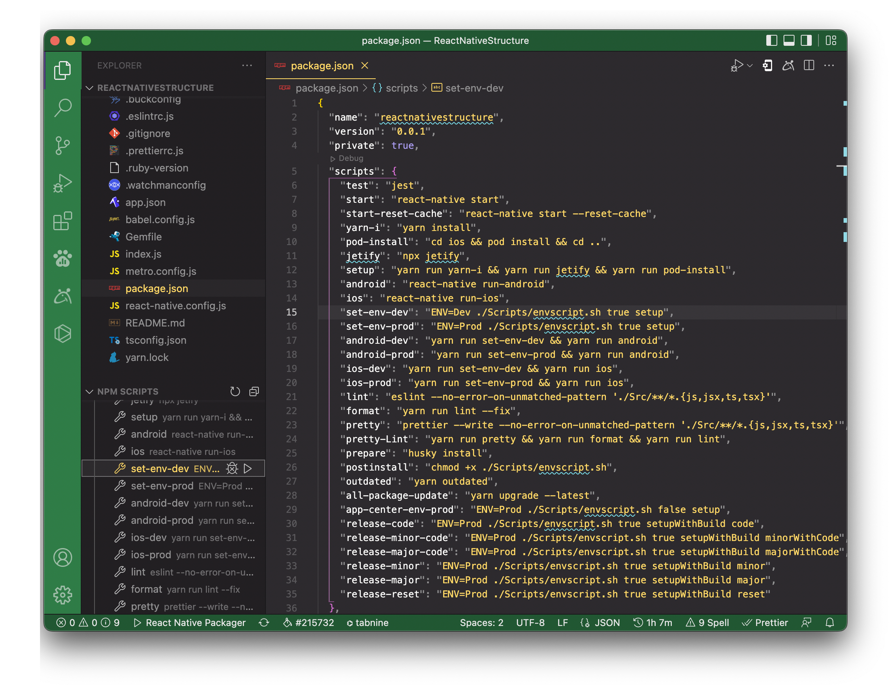

In the current project structure we have to set up Two different types of environment, First one is **Production** and Second one is **Development**.

Open project in the Visual studio code tool.

### 1. Setup Production Environment with **Debug** & **Release** mode.

1. Open terminal `ctrl + ~`
2. Run It
   ```bash
   ENV=prod ./Scripts/envscript.sh setup
   ```

### 2. Setup Development Environment with **Debug** & **Release** mode.

1. Open terminal `ctrl + ~`
2. Run It
   ```bash
   ENV=dev ./Scripts/envscript.sh setup
   ```

## Other Way

### 1. Setup Production Environment with **Debug** & **Release** mode.

1. Open NPM SCRIPT section in EXPLORER section.
1. Trigger play button of `set-env-dev`
   <br />

### 2. Setup Development Environment with **Debug** & **Release** mode.

1. Open NPM SCRIPT section in EXPLORER section.
1. Trigger play button of `set-env-prod`
   <br />

# Explain envscript.sh file in brief

This shell script we have two param pass when excute a script. one is type of operation and second is version type.

#### **_usedColor :_** true, false

#### **_typeOfOperation :_** setup, setupWithBuild

#### **_versionType :_** major, minor, code, majorWithCode, minorWithCode, none.<br />

1. Used Color
   <br />This param with defined to identify custom colors used or not.
1. Type of operation.
   <br />This param with defined to identify which type of operation perform. means
   <br />Let's you have pass `setup` then script only do to all React native and native configuration but not increase build version.
   ```bash
   ENV=dev ./scripts/envscript.sh true setup
   ```
   <br />Let's you have pass `setupWithBuild` then script do to all React native and native configuration with increase React native and native build version based on pass value of second argument `verionType`.
   ```bash
   ENV=dev ./scripts/envscript.sh true setupWithBuild
   ```
1. Version Type.
   <br />Let's explain what is major, minor and code.
   <br />Let's assume our app version defination is **v5.0(4)** then here '5' is major, '0' is minor and '(4)' is build code.

   <br />This param with defined to identify which type of version number upgrade. means
   <br />Let's you have pass `major` then script will increase major version, minor version set zero(0) and build code as it is.

   ```bash
   ENV=dev ./scripts/envscript.sh true setupWithBuild major
   ```

   <br />Let's you have pass `minor` then script will major version as it is, increase minor version and build code as it is.

   ```bash
   ENV=dev ./scripts/envscript.sh true setupWithBuild minor
   ```

   <br />Let's you have pass `code` then script will major version as it is, minor version as it is and increase build code.

   ```bash
   ENV=dev ./scripts/envscript.sh true setupWithBuild code
   ```

   <br />Let's you have pass `majorWithCode` then script will increase major version, minor version set zero(0) and increase build code.

   ```bash
   ENV=dev ./scripts/envscript.sh true setupWithBuild majorWithCode
   ```

   <br />Let's you have pass `minorWithCode` then script will major version as it is, increase minor version and increase build code.

   ```bash
   ENV=dev ./scripts/envscript.sh true setupWithBuild minorWithCode
   ```

   <br />Let's you have pass `none` then script will major version as it is, minor version as it is and build code as it is. means nothing to change in build version.

   ```bash
   ENV=dev ./scripts/envscript.sh true setupWithBuild none
   ```

This Script will change below list of configuration.

1. Replace Firebase google service file - In Both Platform(android/ios)
1. Replace Appcenter config file - In Android Platform
1. Change App Name. - In Both Platform(android/ios)
1. Change Codepush Key. - In Both Platform(android/ios)
1. Change API URL - In React Native Platform
1. Change Sentry URL - In React Native Platform
1. Upgrade version - In All Platform(android/ios/react native)

Script output look like below
<br />
