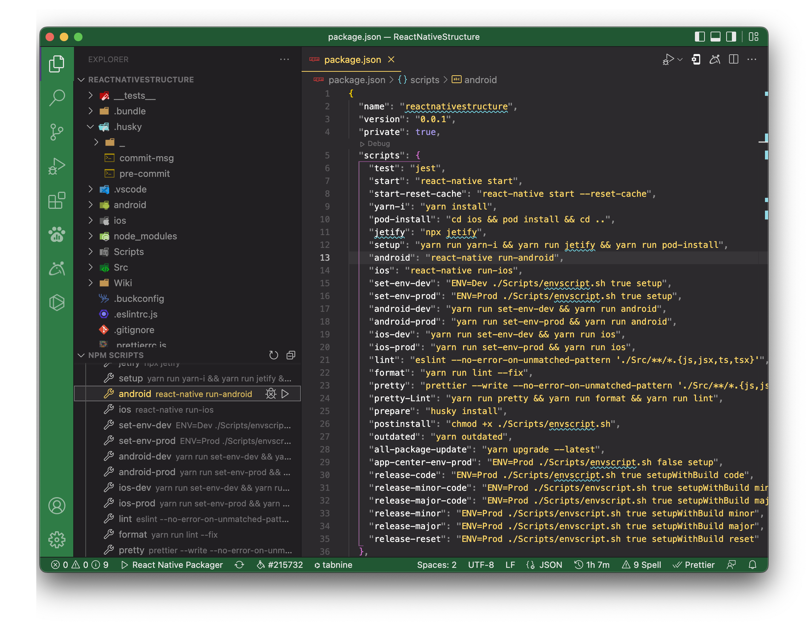

Follow below step to run the application

1. Change directory `cd <dir>` to the project directory
1. Run and build for either OS
   1. Run-on IOS app
       `yarn run ios` **OR** `react-native run-ios`
       If you face issues in the above command then try to run it from `XCode 13.0` **OR** higher version.
   1. Run-on Android app
       First start Genymotion **OR** Native emulator
       `yarn run android` **OR** `react-native run-android`

## Other Way

1. Open project in vs-code
1. Run and build for either OS
   1. Run-on IOS app
      1. Open NPM SCRIPT section in EXPLORER section.
      1. Trigger play button of `ios`
          
          If you face issues in the above command then try to run it from `XCode 13.0` **OR** higher version.
   1. Run-on Android app
      1. First start Genymotion **OR** Native emulator
      1. Trigger play button of `android`
          

**Note:** This npm scripts will lint your code first. If there are no lint errors, then it will run the ios or android app. Otherwise, it will show the lint errors in the terminal.
