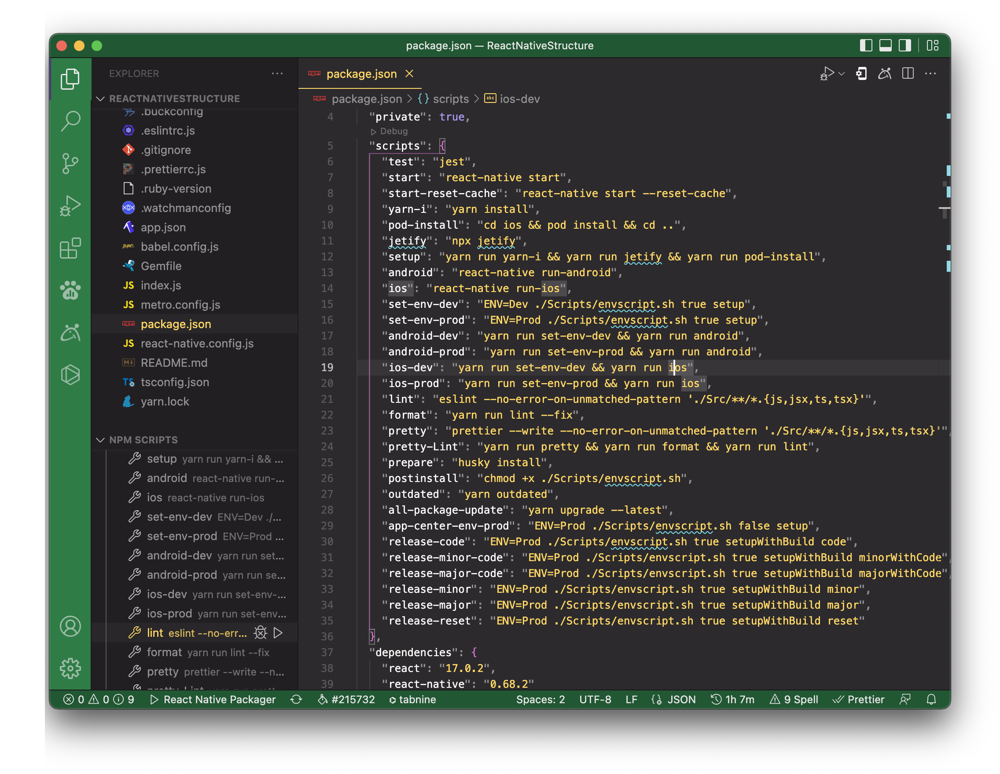
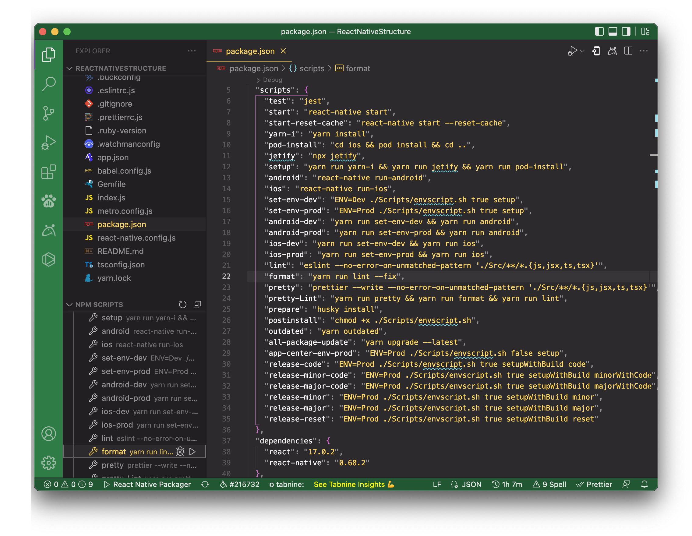
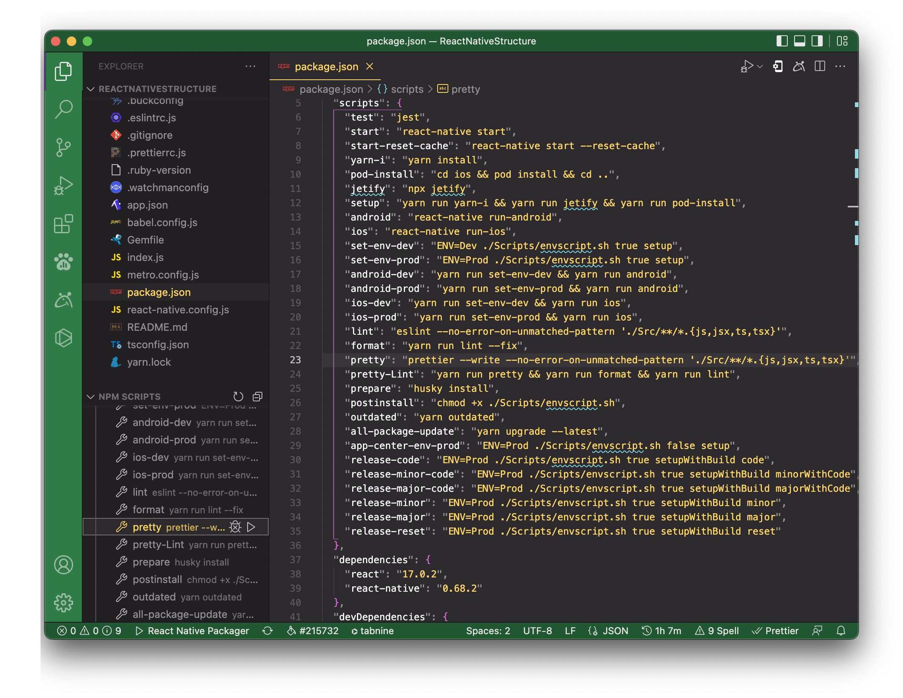

[](https://github.com/feross/standard)

This project adheres to JavaScript Standard for coding style. To maintain coding standards, utilizing features of ES6 and follow best development practices of react-native, this project also uses ES6, some rules of eslint-Airbnb, eslint-plugin-react and eslint-plugin-react-native.

1. **To Lint**

   To find error, run it

   ```bash
   eslint --no-error-on-unmatched-pattern './Src/**/*.{js,jsx,ts,tsx}'
   ```

   To fix/format error, run it

   ```bash
   yarn run lint -- --fix
   ```

   To format prettier, run it

   ```bash
   prettier --write --config --no-error-on-unmatched-pattern .prettierrc.js ./Src/**/*.{js,jsx,ts,tsx}
   ```

   OR
   <br />Trigger play button of `lint`
   <br />

   <br />Trigger play button of `format`
   <br />

   <br />Trigger play button of `pretty`
   <br />

1. **Auto Lint on Commit**

   This is implemented using [husky](https://github.com/typicode/husky). So husky will prevent code-commits from having lint errors. There is no additional setup needed.

1. **Bypass Lint**

   If you have to bypass lint for a special commit that you will come back and clean (pushing something to a branch etc.) then you can bypass git hooks with adding `--no-verify` to your commit command.

1. **Understanding Linting Errors**

   The linting rules are from JS Standard and React-Standard. [Regular JS errors can be found with descriptions here](http://eslint.org/docs/rules/), while [React errors and descriptions can be found here](https://github.com/yannickcr/eslint-plugin-react).

1. **Code Formatting with Prettier in Visual Studio Code**
   <br/>Formatting code consistently is a pain, especially when working on a team. The beauty of modern-day web development is that the tooling has gotten so much better! In this article, we will look at setting up [Prettier](https://prettier.io/) to automatically format your code in Visual Studio Code.

   1. Sample Code
      <br/>For demo purposes, here's the sample code we will be formatting. If you're picky about code formatting, you'll pick up on some obvious missteps immediately.

      - mix of single vs double quotes
      - the first property of the person object should be on its own line
      - the console statement inside of the function should be indented
      - you may or may not like the optional parenthesis surrounding the parameter of the arrow function
        

   1. Installing the Prettier Extension
      <br/>To work with Prettier in Visual Studio Code, you'll need to install the extension. Search for [Prettier - Code Formatter](https://marketplace.visualstudio.com/items?itemName=esbenp.prettier-vscode). You can see the extension below. If you're installing it for the first time, you'll see an "install" button instead of the "uninstall" button you see on mine.
      
   1. The Format Document Command
      <br/>With the Prettier extension installed, we can now leverage it to format our code. We'll work more on this later, but to start, we can use the **Format Document** command.
      <br/>To open the command palette, you can use **Command + Shift + P** on Mac or **Control + Shift + P** on Windows. In the command palette search format, then choose **Format Document**.
      
      You may then be prompted to choose which formatter to use. To do so, click the **Configure** button
      
      Then choose Prettier **- Code Formatter**.
      
      And then VOILA! Your code is nice and formatted. Notice all the fancy improvements!
      1. spacing
      1. line wrappings
      1. consistent quotes
         
   1. Automatically Format on Save
      <br/>So far, we have had to manually run a command to format our code. Instead, you can choose a setting in VS Code to have your files automatically formatted when you save. This has some great benefits.
      <br/>`You never have to manually format your code again!`
      _ ensure code is formatted without having to think about it
      _ code doesn't get checked in that's not formatted
      <br/>To change this setting, use **Command +**, on Mac or **Control +**, on Windows to open the settings menu. Then search for **Editor: Format on Save** and make sure it is checked.
      
      <br/>With this setting in place, you can go about your business writing sloppily formatted code like we all do know that it will all be taken care of automatically for you!
   1. Prettier Configuration in VS Code Settings
      <br/>Prettier does a lot of things for you by default, but you can also customize the settings. Here are a few of the most common settings.

      - Single Quote - choose between single and double quotes
      - Semi - choose whether or not to include semicolons at the end of lines
      - Tab Width - how many spaces you want a tab to consist of

      <br/>Open the settings menu as above. Then, search for **Prettier**. This will bring up all of the settings that you can change right there in your editor.
      
      For example, what if I change the tab width to 10.
      
      Then save my file.
      
      Pretty easy right?! This is probably not the tab width size you want to keep, but it's all up to you!

   1. Creating a Prettier Configuration File
      <br/>The downside to using the built-in settings menu in VS Code is that it doesn't ensure consistency across developers on your team. If you change settings in your VS Code, someone else could have an entirely different set of settings in theirs.
      <br/>**Establish consistent formatting across your team by creating a configuration file!**
      <br/>To solve this, you can create a Prettier configuration file. It has to be titled .prettierrc.(ext) with one of the following extensions.

      - yml, yaml, or json
      - js
      - toml
      - include in package.json file (alternate option)

      <br/>I typically prefer JSON configuration files where you can define key **-> value** pairs for your settings. VS Code will even provide some IntelliSense for you as you type.
      
      Here's an example of a simple configuration file.
      
      For more specifics on the configuration files, check out the Prettier Docs. After creating one of these and checking it into your project, **you can ensure that every team member follows the same formatting rules.**

   1. Wrap Up
      <br/>Don't waste your time manually formatting your code. It takes time that can be better spent writing more code. Take advantage of the amazing modern tools out there and set up Prettier!
