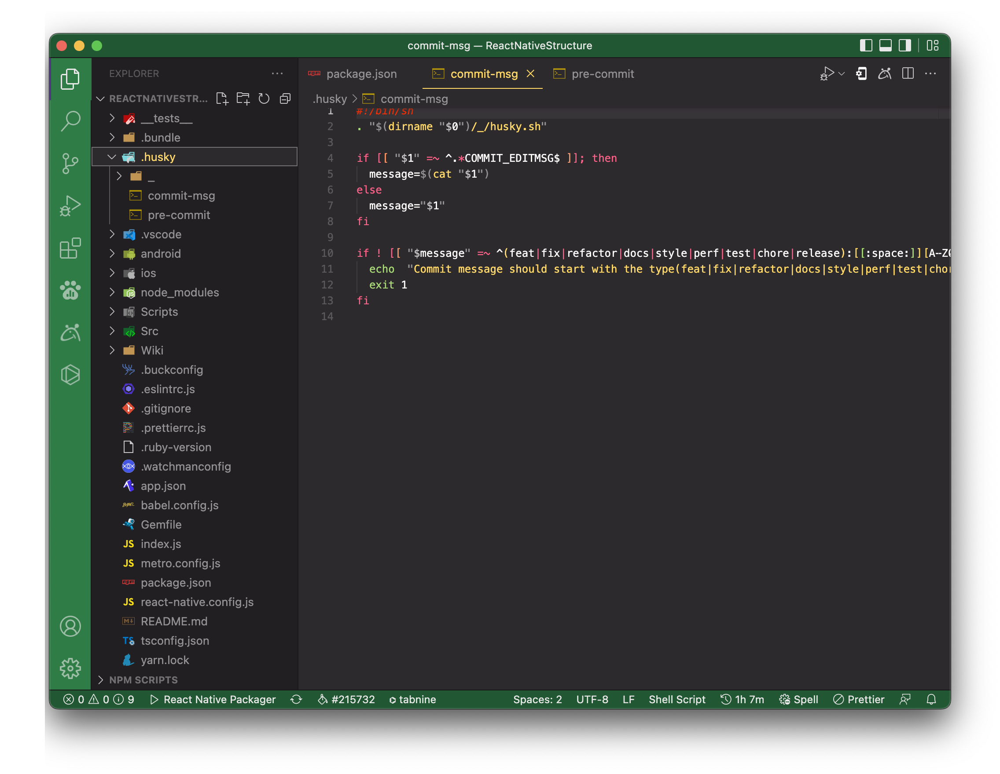
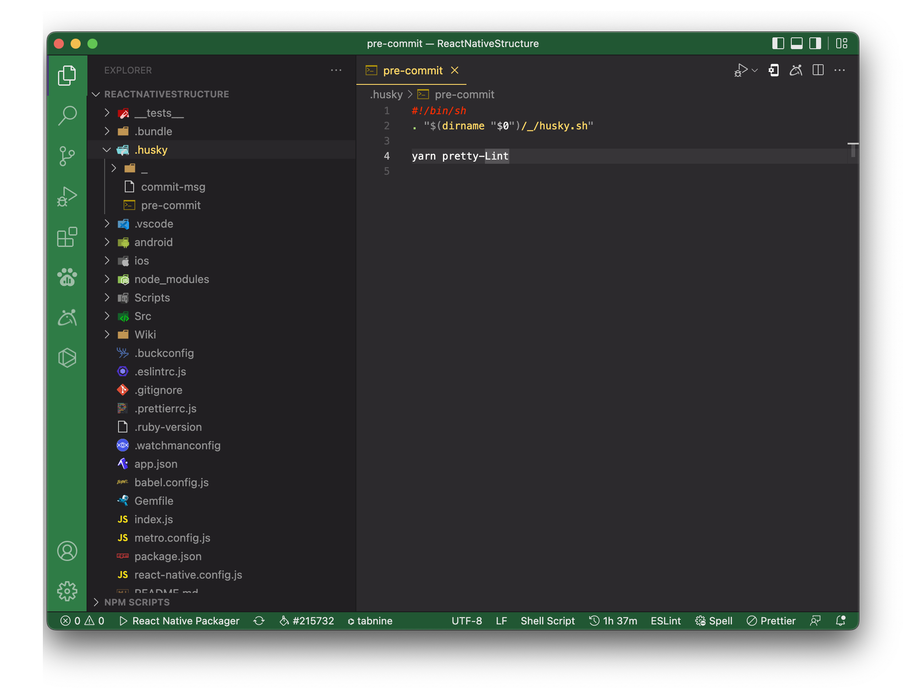

# Commit Message

### A properly formed git commit subject line should always be able to complete the following sentence

If applied, this commit will _\<your subject line here\>_

### Rules for a great git commit message style

- Separate subject from body with a blank line
- Do not end the subject line with a period
- Capitalize the subject line and each paragraph
- Use the imperative mood in the subject line
- Wrap lines at 72 characters
- Use the body to explain what and why you have done something. In most cases, you can leave out details about how a change has been made.

### Information in commit messages

- Describe why a change is being made.
- How does it address the issue?
- What effects does the patch have?
- Do not assume the reviewer understands what the original problem was.
- Do not assume the code is self-evident/self-documenting.
- Read the commit message to see if it hints at improved code structure.
- The first commit line is the most important.
- Describe any limitations of the current code.
- Do not include patch set-specific comments.

Details for each point and good commit message examples can be found on https://wiki.openstack.org/wiki/GitCommitMessages#Information_in_commit_messages

### References in commit messages

If the commit refers to an issue, add this information to the commit message header or body. e.g. the GitHub web platform automatically converts issue ids (e.g. #123) to links referring to the related issue. For issues tracker like Jira, there are plugins that also convert Jira tickets, e.g. [Jirafy](https://chrome.google.com/webstore/detail/jirafy/npldkpkhkmpnfhpmeoahhakbgcldplbj).

In header:

```
[#123] Refer to the GitHub issue…
```

```
CAT-123 Refer to Jira ticket with project identifier CAT…
```

In body:

```
…
Fixes #123, #124
```

### DO

Here's how you can make yours great too:

1. Specify the type of commit:
   1. feat: The new feature you're adding to a particular application
   1. fix: A bug fix
   1. style: Feature and updates related to styling
   1. refactor: Refactoring a specific section of the codebase
   1. test: Everything related to testing
   1. docs: Everything related to documentation
   1. chore: Regular code maintenance.[ You can also use emojis to represent commit types]
1. Separate the subject from the body with a blank line
1. Your commit message should not contain any whitespace errors
1. Remove unnecessary punctuation marks
1. Do not end the subject line with a period
1. Capitalize the subject line and each paragraph
1. Use the imperative mood in the subject line
1. Use the body to explain what changes you have made and why you made them.
1. Do not assume the reviewer understands what the original problem was, ensure you add it.
1. Do not think your code is self-explanatory
1. Follow the commit convention defined by your team

### DON'T

- Don't end the summary line with a period -it's a title and titles don't end with a period.

### Tips

- If it seems difficult to summarise what your commit does, it may be because it includes several logical changes or bug fixes, and are better split up into several commits.

## Utilising commit-msg hook

As we are enforcing commit type and Zoho/Asana task Id in the commit messages, we need to make sure everyone follows this same commit message pattern. We can utilize the pre-commit hooks.
<br/>To enforce a commit message naming policy we can use "commit-msg” pre-commit hook.

### How to setup?

All projects are using a husky pre-commit hook to validate lint.

1. Install `husky`
   ```shell
   yarn add -D husky
   ```
1. Enable Git hooks
   ```shell
   npx husky install
   ```
1. To automatically have Git hooks enabled after install, edit `package.json`
   ```shell
   npm set-script prepare "husky install"
   ```
   You should have:
   ```js
   // package.json
   {
     "scripts": {
       "prepare": "husky install"
     }
   }
   ```
1. Set husky path.
   First move to `Users`->`<Current User>` than open hidden file and folder.
   Open file `.huskyrc`, If not available then create new one with same name
   Added Path for husky installation dir, Like
   export PATH=/opt/homebrew/bin:/opt/homebrew/bin:/opt/homebrew/sbin:/usr/local/bin:/usr/bin:/bin:/usr/sbin:/sbin:/Library/Apple/usr/bin
1. Added more eslint & pritter script
   ```shell
   npm set-script lint "eslint --no-error-on-unmatched-pattern './Src/**/*.{js,jsx,ts,tsx}'"
   npm set-script format "yarn run lint --fix"
   npm set-script pretty "prettier --write --no-error-on-unmatched-pattern './Src/**/*.{js,jsx,ts,tsx}'"
   npm set-script pretty-Lint "yarn run pretty && yarn run format && yarn run lint"
   ```
   You should have:
   ```js
   // package.json
   {
       "scripts" : {
           "lint": "eslint --no-error-on-unmatched-pattern './Src/**/*.{js,jsx,ts,tsx}'",
           "format": "yarn run lint --fix",
           "pretty": "prettier --write --no-error-on-unmatched-pattern './Src/**/*.{js,jsx,ts,tsx}'",
           "pretty-Lint": "yarn run pretty && yarn run format && yarn run lint",
       }
   }
   ```
1. Create a hook
   To add a command to a hook or create a new one, use `husky add <file> [cmd]` (don't forget to run `husky install` before).

   Check & format code before commit(Run static code analysis)

   ```shell
   npx husky add .husky/pre-commit "yarn pretty-Lint"
   ```

   Or (Mannual)
   First move to `<Current Project Root Dir>`->`./husky` than open hidden file and folder.
   Open file `pre-commit`, If not available then create new one with same name
   Added below code

   ```shell
   #!/bin/sh
   . "$(dirname "$0")/_/husky.sh"

   yarn pretty-Lint
   ```

   Check format of commit message

   ```shell
   npx husky add .husky/commit-msg
   "if [[ "$1" =~ ^.*COMMIT_EDITMSG$ ]]; then
     message=$(cat "$1")
   else
     message="$1"
   fi

   if ! [[ "$message" =~ ^(feat|fix|refactor|docs|style|perf|test|chore):[[:space:]][A-Z0-9]+-[A-Z0-9]+:[[:space:]][A-Za-z0-9].*$ ]]; then
     echo  "Commit message should start with the type(feat|fix|refactor|docs|style|perf|test|chore), followed by Zoho or Asana task-id and task name (example: 'feat: TA1-T123: Enable Client Certificate Support')"
     exit 1
   fi"
   ```

   Or (Mannual)
   First move to `<Current Project Root Dir>`->`./husky` than open hidden file and folder.
   Open file `commit-msg`, If not available then create new one with same name
   Added below code

   ```shell
   #!/bin/sh
   . "$(dirname "$0")/_/husky.sh"

   if [[ "$1" =~ ^.*COMMIT_EDITMSG$ ]]; then
     message=$(cat "$1")
   else
     message="$1"
   fi

   if ! [[ "$message" =~ ^(feat|fix|refactor|docs|style|perf|test|chore):[[:space:]][A-Z0-9]+-[A-Z0-9]+:[[:space:]][A-Za-z0-9].*$ ]]; then
     echo  "Commit message should start with the type(feat|fix|refactor|docs|style|perf|test|chore), followed by Zoho or Asana task-id and task name (example: 'feat: TA1-T123: Enable Client Certificate Support')"
     exit 1
   fi
   ```

### Troubleshoot

1. Install Husky
   Check here https://typicode.github.io/husky


<br />
<br />

### How it works?

1. The commit-msg file is executable and it will run the script written in it whenever you will try to commit code.
1. That’s it. Now it will save you from committing code with bad commit messages and it will save your PR from getting rejected by code reviewer.
1. Example commit message can be like this, `feat: TA1-T123: Enable Client Certificate Support`

<br/>To explore more on how to use Git hooks, please refer these tutorials, https://www.atlassian.com/git/tutorials/git-hooks

**Note: It is everyone’s own responsibility to copy this pre-commit hook into .git/hooks directory and make it executable. It's everyone's own responsibility to utilize this script into your current and upcoming projects.**

# Git Flow

1. For New Feature, Always new branch with a single commit, which means at the end of the day you should commit your code until the feature is not complete. Once the feature is completed then squash all previous commit & rebase the current branch with develop branch then generate PR.

1. For Bug/Issue, Create one branch with multiple commits, which means one issue with one commit but not marge multiple issues on a single commit. Also per PR maximum, 5 fixes can be included
